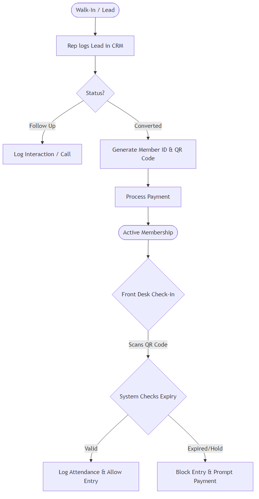
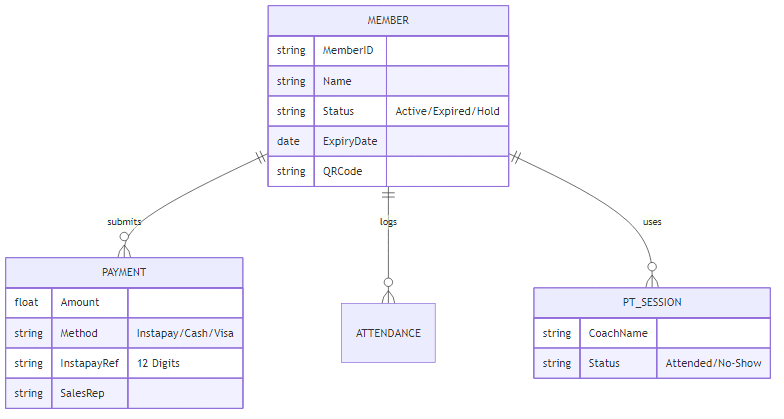
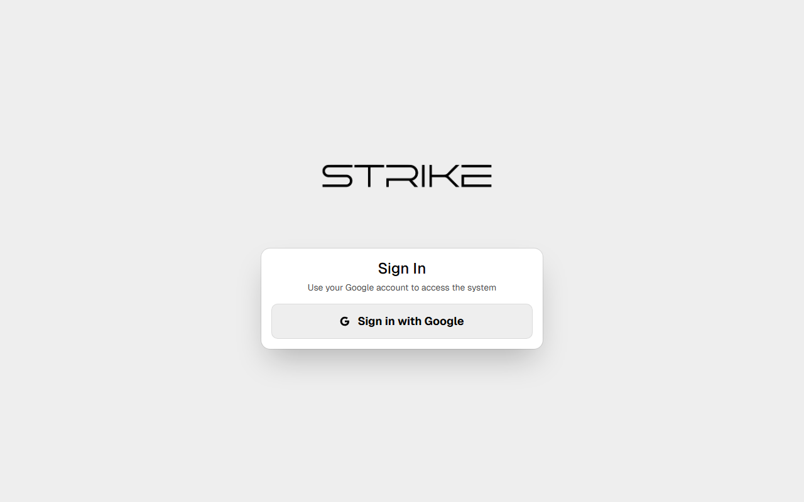

# Strike Boxing CRM: Executive Handover & System Manual

## 1. Executive Summary & Project Brief

### High-Level Overview
Welcome to your new **Strike Boxing CRM & Management System**. This is not a generic off-the-shelf product; it is a fully custom, enterprise-grade cloud application engineered specifically for the fast-paced, high-volume operational needs of your gym. From the moment a lead walks through the door to their daily QR Code check-ins and monthly billing, this system tracks, secures, and automates your entire business.

### Core Problems Solved
*   **Revenue Protection:** Tying Instapay and Cash transactions directly to membership expiry dates, making it impossible for members to train for free.
*   **Attendance Bottlenecks:** A lightning-fast automated QR Code turnstile/scanner system.
*   **Data Silos:** Centralized tracking of Leads, Active Members, Private Training (PT) packages, and Financials in one unified dashboard.

### "Behind the Scenes": The Technical Heavy Lifting
Building this system required hundreds of hours of custom engineering, database architecture, and optimization to ensure it operates flawlessly at scale.
*   **Serverless Cloud Infrastructure:** Powered by Google Firebase, guaranteeing 99.99% uptime, zero server maintenance fees, and automated global backups.
*   **Impenetrable Security (RBAC):** We wrote over 350 lines of custom `firestore.rules`. This means a Sales Rep is physically blocked at the database level from altering past financial records, deleting users, or extending memberships without logging a payment.
*   **Optimistic UI & Lazy Loading:** To ensure the system never lags, even with thousands of members, we implemented "Lazy Loading" (only fetching data exactly when you click on it) and "Optimistic UI" (updating the screen instantly while syncing to the cloud in the background). This keeps your Google Cloud costs near $0/month.

---

## 2. System Architecture & Data Flow

### The User Journey
This flowchart maps the automated pipeline custom-built for your operational flow.

### Business Database Structure (ERD)
This diagram illustrates how your financial data is tightly coupled to member actions, ensuring perfect accounting.

---

## 3. The Gym Owner's In-Depth User Manual

### Module A: The Command Center (Dashboard)
The Dashboard is the financial and operational brain of the gym. It reads thousands of database entries and calculates your metrics in real-time.

*   **How to Use:** Log in and immediately see your gross revenue split by payment method (Cash vs. Instapay). Check the active check-ins to monitor gym floor capacity, and review the Sales Rep leaderboard to see who is hitting their monthly targets.

### Module B: Member Management
The central directory for all client data, optimized to find anyone instantly.

*   **How to Add:** Click **+ New Client**, enter their basic details, and select a membership package. The system auto-generates their unique Member ID and secure QR Code.
*   **How to Edit/Suspend:** Click on any member's name. In their Details Panel, you can change their status to "Hold" to pause their expiry date, or view every single interaction your staff has had with them.

### Module C: Billing & Invoicing
The most heavily secured module in the system. It guarantees every dollar is tracked.

*   **Automated Payment Flows:** When you log a payment for a "1 Month Package", the system automatically calculates exactly 30 days from today and updates the member's profile.
*   **Instapay Tracking:** If a rep selects "Instapay", the system forces them to enter a 12-digit reference number, allowing you to easily audit payments against your bank app.

### Module D: Class & Staff Scheduling (PT Sessions)
Prevents trainers from giving away free sessions and tracks exact package consumption.

*   **How to Log a Session:** Navigate to PT Sessions. Select the member, select the coach, and mark the status as "Attended" or "No Show".
*   **Automatic Deduction:** The system instantly deducts one session from the client's purchased PT package quota.

**[INSERT SCREENSHOT HERE: The PT Sessions management screen showing the list of scheduled sessions, assigned coaches, and the remaining session quota for a client.]**

### Module E: Access Control & Check-ins
Designed for ultimate speed at the front desk.

*   **How it Works:** Keep the Attendance tab open. Members present their phone. The webcam reads the QR code in milliseconds. A green screen logs attendance; a red screen alerts the receptionist that the member owes money.

---

## 4. Technical Reliability & Maintenance (Peace of Mind)

Your gym's data is its most critical asset. We have engineered this system to be bulletproof.

*   **Automated Global Backups:** Powered by Google Cloud, your data is replicated across multiple servers. If a laptop breaks at the gym, you lose nothing.
*   **Data Encryption:** All client and financial data is encrypted at rest using AES-256 encryption.
*   **Hidden Audit Logs:** Every action (e.g., creating a payment, deleting a user, extending a membership) is permanently recorded in a hidden, tamper-proof `auditLogs` database. If anything goes wrong, you have a permanent trail of exactly who did what and when.

---

## 5. Appendices / Quick Reference Cheat Sheet

*   **How to quickly process a drop-in:** *Payments Tab -> Add Payment -> Select "Walk-in Package" -> Enter Amount -> Save.*
*   **How to freeze a membership:** *Clients Tab -> Search Name -> Click Edit -> Change Status to "Hold" -> Select End Date.*
*   **How to check a rep's sales:** *Dashboard -> Scroll to "Rep Performance" chart.*
